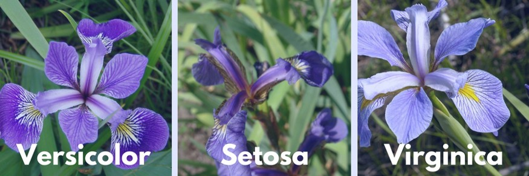

# Predicting_Iris_Flower_Species

## Problem Statement:
Create the model that can classify the different species of the Iris flower.

## Problem solving:
- create the dataset.
- Build the model
- Train the model
- Make predictions.

## Iris Flower:
Iris is the family in the flower which contains the several species such as the iris.setosa,iris.versicolor,iris.virginica,etc.
